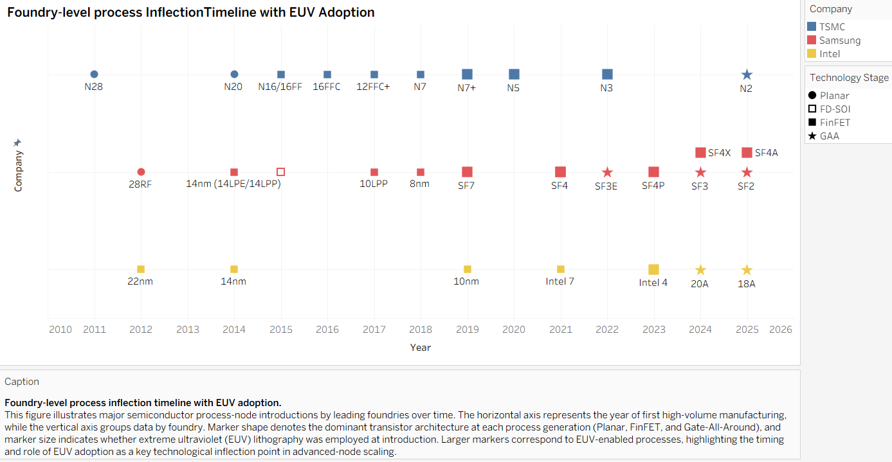

## Overview

This project analyzes the evolution of advanced semiconductor manufacturing by using a **foundry-level technology timeline** as the primary analytical lens.  
Rather than ranking process nodes by nominal node size or vendor performance claims, the analysis focuses on **structural decision points**—specifically transistor architecture and system-level manufacturing choices—across Intel, TSMC, and Samsung.

The underlying data is curated from foundry-specific datasets and consolidated into a unified, Tableau-ready CSV to support cross-foundry comparison on a shared timeline.

By visualizing each foundry’s process milestones on a shared timeline, this project aims to reveal non-obvious patterns in how advanced-node progress is achieved, delayed, or fundamentally redirected under physical, economic, and manufacturability constraints.

---
## Data Structure and Preparation

### Source Datasets
The project initially maintains three foundry-specific datasets:
- `process_nodes_TSMC.csv`
- `process_nodes_Samsung.csv`
- `process_nodes_Intel.csv`

Each file records publicly disclosed process milestones using a consistent schema, including node family, technology variant, transistor architecture, EUV usage, and first production year.

### Unified Dataset for Visualization
For visualization and comparative analysis, the three foundry-specific datasets are merged into a single consolidated dataset:

- `foundry_technology_timeline.csv`

This unified dataset:
- Aligns column definitions across foundries
- Preserves foundry identity as an explicit categorical field
- Enables direct import into Tableau for timeline and inflection-point visualization
- Serves as the canonical input for all figures in this repository

The original foundry-level CSV files are retained for transparency, provenance, and future extension.

---

## Visualization
The core artifact of this project is a timeline visualization constructed from the unified dataset, with the following design characteristics:

- Each foundry is assigned to a fixed horizontal lane
- Discrete process milestones are plotted along the timeline by year
- Key attributes, such as transistor architecture and EUV adoption, are emphasized through visual encoding

This visualization is specifically designed for Tableau and supports controlled jittering and categorical visual encoding to handle overlapping milestones occurring in the same or adjacent years across different foundries, enabling direct comparison of their respective technology evolution paths.

The visualization clearly reveals periods of prolonged architectural stability, critical moments of forced transition, and divergences in strategic timing among the foundries.

See Methodology → Data Preparation for details on node-level representation and visualization-driven data reduction.

---

## Research Questions

**RQ1 — Process Node Evolution (Architecture-Based Timeline)**  
How have advanced semiconductor process nodes evolved over time when analyzed through transistor architecture transitions rather than nominal node labels?

**RQ2 — Technology Leadership and Differentiation**  
How do leading foundries differentiate their process strategies through the timing of architectural transitions and EUV adoption?

---
## Scope and Analytical Constraints
This project explicitly considers the limitations of publicly available data, including incomplete disclosures, marketing-driven narratives, and inconsistent node naming conventions.

---

## Methodology

### Data Sources

This project relies exclusively on publicly available sources, including:

- Foundry press releases and technology disclosures
- Conference presentations (IEDM, VLSI, etc.)
- Public roadmaps and technical whitepapers
- Industry analysis articles and archival reporting

Raw data is curated at the foundry level and subsequently integrated into a unified dataset for visualization and comparative analysis.
No proprietary yield, cost, or internal design data is used.

**Visualization-Oriented Node Representation**

To support visual clarity and effective comparison in the Tableau timeline, the unified dataset adopts a node-level representation rather than a full node-family listing.

In cases where a single process generation includes multiple closely related node families or variants, only one representative record is retained for visualization. This representative entry serves as the anchor point for that generation on the timeline, while family-level or derivative entries are intentionally omitted.

This design choice reduces visual clutter, prevents excessive overplotting, and enables stable horizontal lane encoding and controlled jitter behavior within Tableau. The simplification is applied consistently across foundries where applicable and is intended solely to improve readability and interpretability in the visualization.

Omitted node-family variants are not considered technologically insignificant; they are excluded only to maintain a clean and comparable timeline view and do not affect the underlying analytical conclusions.

### Modeling Assumptions

- Nominal process-node names are treated as **generational labels**, not physical dimensions  
- Architectural changes are considered more significant than incremental node scaling  
- Public announcements are interpreted conservatively, with uncertainty noted when applicable  

The analysis prioritizes **comparability and interpretability** over absolute technical precision.

---

## Key Findings

### 1. The FinFET Architectural Plateau

After the industry-wide transition from planar transistors to FinFET around 2012–2014, transistor architecture remained largely unchanged for nearly a decade—even as nodes scaled from 7nm to 3nm.

This apparent plateau does not indicate stagnation. Instead, progress during this period was driven by:

- Lithography scaling (including multi-patterning and EUV adoption)  
- Materials engineering and device optimization  
- Application-specific process variants  

### 2. Complexity as a Substitute for Architecture Change

Rather than introducing new transistor architectures, foundries extended FinFET through increasingly complex process techniques.  
Innovation shifted from geometry to execution, cost management, and yield optimization.

### 3. True Inflection Points Are Structural, Not Nominal

Major generational transitions occur when existing architectures can no longer be extended:

- Gate-All-Around (GAA) transistors represent a fundamental change in electrostatic control  
- Backside power delivery reconfigures system-level integration and routing constraints  

These transitions mark **structural inflection points**, not merely new node names.

---

## Comparative Analysis: Intel, TSMC, and Samsung

- **TSMC** emphasized risk-managed scaling, extending FinFET longer while prioritizing yield and ecosystem stability  
- **Samsung** pursued earlier architectural experimentation, accepting higher initial manufacturing risk  
- **Intel** combined aggressive architectural shifts with system-level innovations such as backside power delivery  

Differences in timing reflect not just technical capability, but also strategic tolerance for risk and cost.

---

## Industry Context (Interpretive, Not Quantitative)

Advanced-node manufacturing increasingly depends on:

- EUV lithography tooling availability  
- Materials readiness and process-integration maturity  
- Co-optimization with EDA tools and customers  

These observations provide contextual background rather than direct analytical conclusions, as quantitative supply-chain and cost data are outside the scope of this study.

---

## Limitations

This analysis is constrained by the nature of public data:

- Disclosures are incomplete and sometimes marketing-driven  
- Yield, defect density, and true cost structures are unavailable  
- Node naming conventions obscure cross-foundry comparability  

As a result, conclusions should be interpreted as **directional and structural**, not definitive measurements.

---

## Conclusion

Viewed through a foundry-level timeline, advanced semiconductor progress is not a steady sequence of shrinking node numbers, 
but a pattern of **extended architectural stability punctuated by forced structural transitions**.

This framework reframes node evolution as a series of engineering trade-offs under physical, economic, 
and manufacturability constraints, offering a clearer lens for understanding past transitions and anticipating future ones.

---

## Future Work

Potential extensions of this project include:

- Advanced packaging and chiplet integration timelines  
- High-NA EUV adoption and ecosystem readiness  

---

## References
All sources used in this project are publicly available and cited at the data or note level within the repository.
